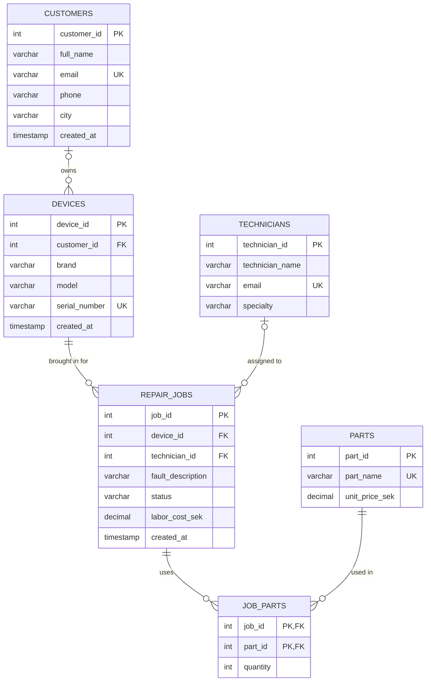

```mermaid

erDiagram
    CUSTOMERS |o--o{ DEVICES : owns
    DEVICES ||--o{ REPAIR_JOBS : "brought in for"
    TECHNICIANS |o--o{ REPAIR_JOBS : "assigned to"
    REPAIR_JOBS ||--o{ JOB_PARTS : uses
    PARTS ||--o{ JOB_PARTS : "used in"

    CUSTOMERS {
        int customer_id PK
        varchar full_name
        varchar email UK
        varchar phone
        varchar city
        timestamp created_at
    }
    DEVICES {
        int device_id PK
        int customer_id FK
        varchar brand
        varchar model
        varchar serial_number UK
        timestamp created_at
    }
    TECHNICIANS {
        int technician_id PK
        varchar technician_name
        varchar email UK
        varchar specialty
    }
    REPAIR_JOBS {
        int job_id PK
        int device_id FK
        int technician_id FK
        varchar fault_description
        varchar status
        decimal labor_cost_sek
        timestamp created_at
    }
    PARTS {
        int part_id PK
        varchar part_name UK
        decimal unit_price_sek
    }
    JOB_PARTS {
        int job_id PK, FK
        int part_id PK, FK
        int quantity
    }
```
